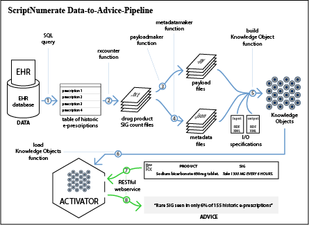

# Script Numerate Collection

## Overview

A data-to-advice pipeline system that leverages the Knowledge Grid to determine whether a prescription ordered in the hospital has a common, rare, or unprecedented "Sig"

Here is an overview:

## Status
The current release of Script Numerate collection of knowledge objects is 

This release contains four KOs, as listed.

1. [DIGOXIN 250 MCG/ML INJECTION SOLUTION](https://library.kgrid.org/#/object/99999%2F104208sig%2Fv0.0.1)

1. [MUPIROCIN 2 % TOPICAL OINTMENT](https://library.kgrid.org/#/object/99999%2F106346sig%2Fv0.0.1)

1. [ACYCLOVIR 400 MG TABLET](https://library.kgrid.org/#/object/99999%2F197311sig%2Fv0.0.1)

1. [ALLOPURINOL 100 MG TABLET](https://library.kgrid.org/#/object/99999%2F197319sig%2Fv0.0.1)
